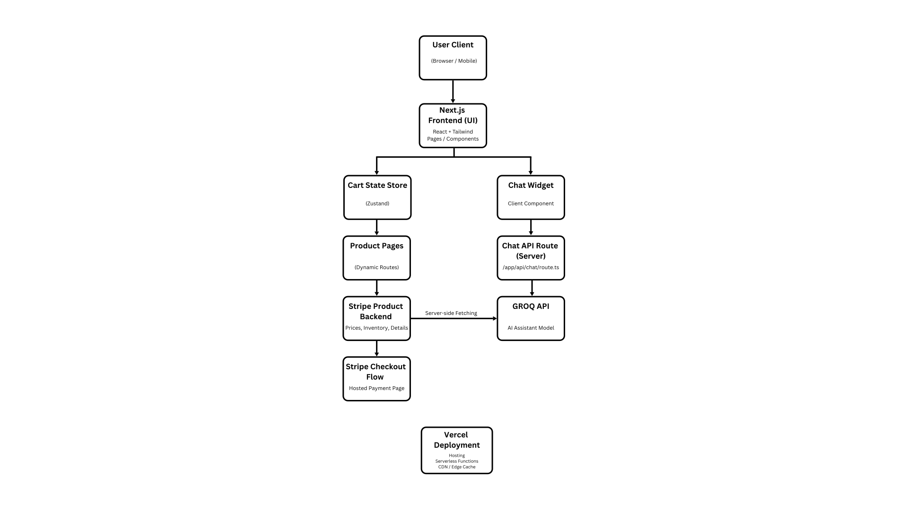

# CourtWave

CourtWave is a modern e‑commerce platform built for a padel racket business. It delivers a fast, elegant shopping experience powered by **Next.js**, **React**, **Tailwind CSS**, **TypeScript**, **Stripe**, and a **GROQ‑based AI assistant**.

Deployed on **Vercel** for optimal performance and seamless CI/CD.

---

## 🚀 Features

* **Lightning‑fast storefront** built with Next.js App Router
* **Dynamic product pages** with real‑time data from Stripe
* **Secure checkout** powered by Stripe Payments
* **AI shopping assistant** using GROQ API for conversational product guidance
* **Responsive UI** designed with Tailwind CSS
* **State‑managed cart** for smooth, persistent shopping
* **Optimized images & assets** served through Vercel

---

## 🏗️ Project Structure

```
CourtWave/
├── app/                     
│   ├── about/
│   ├── api/chat/route.ts   
│   ├── checkout/
│   ├── contact/
│   ├── gallery/
│   ├── products/
│   │   └── [id]/page.tsx   
│   ├── success/
│   ├── layout.tsx
│   ├── page.tsx
│   └── globals.css
│
├── components/              
│   ├── ui/                  
│   ├── navbar.tsx
│   ├── footer.tsx
│   ├── carousel.tsx
│   ├── chat-widget.tsx
│   ├── product-card.tsx
│   ├── product-detail.tsx
│   └── product-list.tsx
│
├── lib/                     
│   ├── stripe.ts            
│   └── utils.ts
│
├── store/                   
│   └── cart-store.ts
│
├── public/                  
│   └── (gallery images, icons, SVGs)
│
└── .next/                   
```

---

## 🧩 Architecture Overview

### **1. Client Layer (Next.js + React)**

* Renders all storefront pages
* Manages cart state via Zustand store
* Handles UI interactions (product browsing, gallery, chat widget)

### **2. Data Layer (Stripe)**

* Stripe stores **product data**, pricing, and inventory
* Dynamic product pages fetch details at request time

### **3. Payments Layer (Stripe Checkout)**

* Secure hosted checkout page
* Handles all billing, payment methods, and order confirmation

### **4. Chat Assistant (GROQ API)**

* `/app/api/chat/route.ts` forwards customer questions to a GROQ-powered model
* Provides:

  * product recommendations
  * rules explanations
  * sizing guidance
  * FAQs

### **5. Deployment (Vercel)**

* Automatic deployments on commit
* Image optimization
* Edge-cached routes for speed

---

## 🛠️ Tech Stack

| Technology       | Purpose                            |
| ---------------- | ---------------------------------- |
| **Next.js 16**   | Routing, rendering, server actions |
| **React**        | Component UI architecture          |
| **Tailwind CSS** | Styling & layout                   |
| **TypeScript**   | Type safety                        |
| **Stripe**       | Products + checkout                |
| **GROQ API**     | AI shopping assistant              |
| **Zustand**      | Cart state management              |
| **Vercel**       | Hosting & deployment               |

---

## Architecture Diagram


## 📦 Getting Started

### **Clone the repo:**

```
git clone https://github.com/yourusername/CourtWave.git
cd CourtWave
```

### **Install dependencies:**

```
npm install
```

### **Set up environment variables:**

Create a `.env.local` file:

```
NEXT_PUBLIC_STRIPE_PUBLISHABLE_KEY=
STRIPE_SECRET_KEY=

NEXT_PUBLIC_BASE_URL=

NEXT_PUBLIC_EMAILJS_SERVICE_ID=
NEXT_PUBLIC_EMAILJS_TEMPLATE_ID=
NEXT_PUBLIC_EMAILJS_PUBLIC_KEY=

GROQ_API_KEY=
```

### **Run Project:**

```

npm run dev
```
